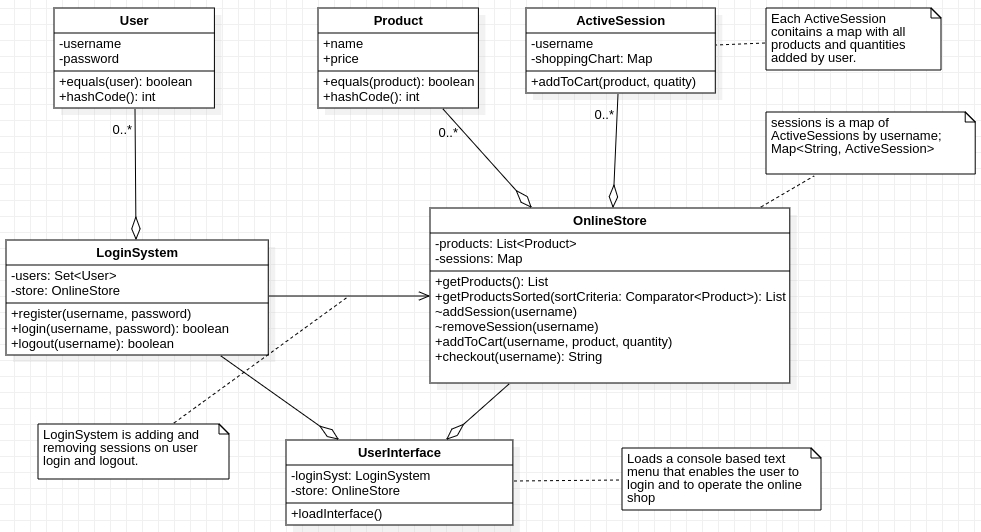

# Implement the following exercises

## Exercise 1

Create a Java program that simulates a simple student grade management system using a list and a custom class. 
The system should be able to store a student's name, ID, and their grades for multiple subjects 
(use a HashMap<String, Integer>, grade by subject name). 
It should also be able to perform the following operations:

-[x] Add a student to the list.
-[x] Add student grades.
-[x] Remove a student from the list.
-[x] Update a student's information.
-[x] Calculate the average grade of a student.
-[x] Display the list of students.

Add minimal unit tests for the first 4 operations.

## Exercise 2

Create a Java program that simulates a unique vehicle registry system using a Set and a custom class.
The system should be able to store a vehicle's VIN (Vehicle Identification Number), license plate, make, model, and year.
Since the VIN is a unique identifier for each vehicle, the system should not allow duplicate entries based on the VIN (hint: equals() and hashCode()).
It should be able to perform the following operations:

-[x] Add a vehicle to the registry (if it doesn't already exist).
-[x] Remove a vehicle from the registry using the VIN.
-[x] Check if a vehicle with a given VIN is in the registry.
-[x] Display the list of vehicles in the registry.

Add minimal unit tests for the first 3 operations.

## Exercise 3

Given the UML class diagram above, implement the corresponding Java program.
The application's interface should be implemented as a console based menu.
Read the notes from the diagram to understand the requirements.

**Note 1: Constructors and setter\getter methods are not represented in the diagram but can\should be implemented."**

**Note 2: You can add any extra methods if required.**

**Note 3: Implement unit tests for the main operations.**
